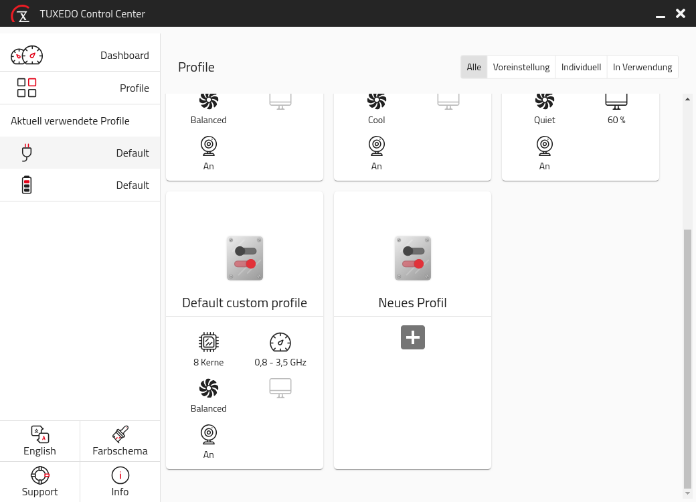

# TUXEDO Control Center

This software gives TUXEDO laptop users full control over their hardware like CPU cores and fan speed. To get a more detailed description of features, plans and the ideas behind please check our [press release](https://www.tuxedocomputers.com/en/Infos/News/Everything-under-control-with-the-TUXEDO-Control-Center.tuxedo).

## Using it

There are pre-build packages for Ubuntu 16.04/18.04/20.04 as well as openSUSE Leap 15.1 and Tumbleweed available at our repositories. For details please have a look [over here](https://www.tuxedocomputers.com/en/Infos/Help-and-Support/Instructions/Add-TUXEDO-Computers-software-package-sources.tuxedo#).

## Project structure

```
tuxedo-control-center
|  README.md
|--src
|  |--ng-app            Angular GUI (aka electron renderer)
|  |--e-app             Electron main
|  |--service-app       Daemon part (Node 12)
|  |--common            Common shared sources
|  |  |--classes
|  |  |--models
|  |--dist-data         Data needed for packaging
|--build-src            Source used for building
```

## Development setup

1. Install git, nodejs, gcc, g++, make \
   Ex (deb):
   ```
   apt install -y git

   curl -sL https://deb.nodesource.com/setup_12.x | sudo -E bash -
   apt-get install -y nodejs

   apt install -y gcc g++ make
   ```
2. Clone & install libraries

   `git clone https://github.com/tuxedocomputers/tuxedo-control-center.git`

   `cd tuxedo-control-center`

   `npm install`

   Note: Do *not* continue with `npm audit fix`. Known to cause various issues.

3. Install service file that points to development build path (or use installed service from packaged version)
   
   Manual instructions:
   1. Copy `tccd.service` and `tccd-sleep.service` (from src/dist-data) to `/etc/systemd/system/`
   2. Edit the `tccd.service` (exec start/stop) to point to `<dev path>/dist/tuxedo-control-center/data/service/tccd`.
   3. Copy `com.tuxedocomputers.tccd.conf` to `/usr/share/dbus-1/system.d/`
   4. Start service `systemctl start tccd`. (And enable for autostart `systemctl enable tccd tccd-sleep`)

### NPM scripts 
`npm run <script-name>`

| Script name                    | Description                                                     |
| ------------------------------ | --------------------------------------------------------------- |
| build                          | Build all apps service/electron/angular                         |
| start                          | Normal start of electron app after build                        |
| start-watch                    | Start GUI with automatic reload on changes to angular directory |
| test-common                    | Test common files (jasmine)                                     |
| gen-lang                       | Generate base for translation (`ng-app/assets/locale/lang.xlf`) |
| pack-prod -- all \| deb \| rpm | Build and package for chosen target(s)                          |
| inc-version-patch              | Patch version increase (updates package.json files)             |
| inc-version-minor              | Minor version increase (updates package.json files)             |
| inc-version-major              | Major version increase (updates package.json files)             |

### Debugging
Debugging of electron main and render process is configured for vscode in .vscode/launch.json

## Screenshots





