# TUXEDO Control Center

The TUXEDO Control Center (short: TCC) gives TUXEDO laptop users full control over their hardware like CPU cores, fan speed and more. \
To get a more detailed description of features, plans and the ideas behind please check our press release ([english](https://www.tuxedocomputers.com/en/Infos/News/Everything-under-control-with-the-TUXEDO-Control-Center.tuxedo) | [german](https://www.tuxedocomputers.com/de/Infos/News/Alles-unter-Kontrolle-mit-dem-TUXEDO-Control-Center_1.tuxedo)) and info pages ([english](https://www.tuxedocomputers.com/en/TUXEDO-Control-Center.tuxedo#) | [german](https://www.tuxedocomputers.com/de/TUXEDO-Control-Center.tuxedo)).

## Using it

There are pre-build packages available at our repositories. For details please have a look [over here](https://www.tuxedocomputers.com/en/Add-TUXEDO-software-package-sources.tuxedo).

Note: TCC depends on `tuxedo-drivers` for some core functionality like fan control.

## Project structure

```
tuxedo-control-center
|  README.md
|--src
|  |--ng-app            Angular GUI (aka electron renderer)
|  |--e-app             Electron main
|  |--service-app       Daemon part (Node 24)
|  |--common            Common shared sources
|  |  |--classes
|  |  |--models
|  |--dist-data         Data needed for packaging
|--build-src            Source used for building
```

## Development setup

1. Install git, gcc, g++, make, nodejs, npm, libudev-dev and rpm \
    Ex (deb):
    ```
    curl -sL https://deb.nodesource.com/setup_24.x | sudo -E bash -

    sudo apt install -y git gcc g++ make nodejs libudev-dev rpm
    ```
2. Clone & install libraries
    ```
    git clone https://github.com/tuxedocomputers/tuxedo-control-center

    cd tuxedo-control-center

    npm clean-install
    ```

3. Install service file that points to development build path (or use installed service from packaged version)
   
   Manual instructions:
   1. Copy `tccd.service` and `tccd-sleep.service` (from `<tcc folder>/src/dist-data`) to `/etc/systemd/system/`
   2. Execute `npm run build` in `<tcc folder>`
   3. Edit the `tccd.service` (exec start/stop) to point to `<tcc folder>/dist/tuxedo-control-center/data/service/tccd`
   4. Copy `<tcc folder>/src/dist-data/com.tuxedocomputers.tccd.conf` to `/usr/share/dbus-1/system.d/`
   5. Start service with `systemctl start tccd`
   6. Enable autostart with `systemctl enable tccd tccd-sleep`
   7. Execute `npm run start` in `<tcc folder>` to start the GUI

### NPM scripts 
`npm run <script-name>`

| Script name                  | Description                                                 |
| ---------------------------- | ----------------------------------------------------------- |
| build-release (autoversion)  | Build and package release deb and rpm                       |
| pack-prod all \| deb \| rpm  | Build and package release version for chosen target(s)      |
| pack-debug all \| deb \| rpm | Build and package debug version for chosen target(s)        |
| build-prod                   | Build service/electron/angular (release version)            |
| build-debug                  | Build service/electron/angular (debug version)              |
| start                        | Start electron app after build                              |
| start-watch                  | Start with automatic reload on changes to angular directory |
| tests                        | Run tests                                                   |

### Debugging
Debugging of electron main and render process is configured for vscode in .vscode/launch.json

## Screenshots
### English

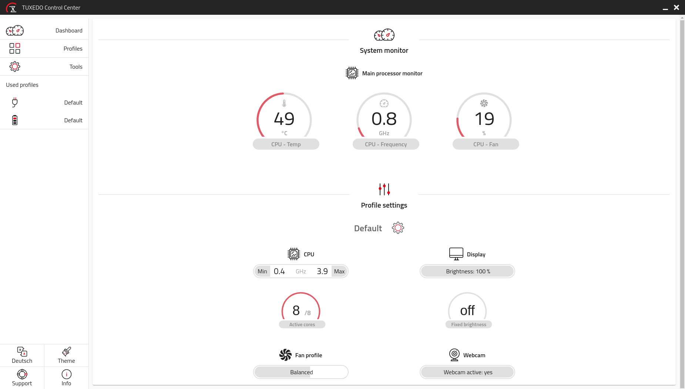
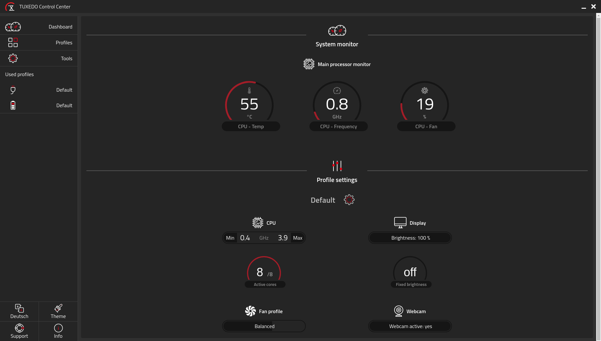

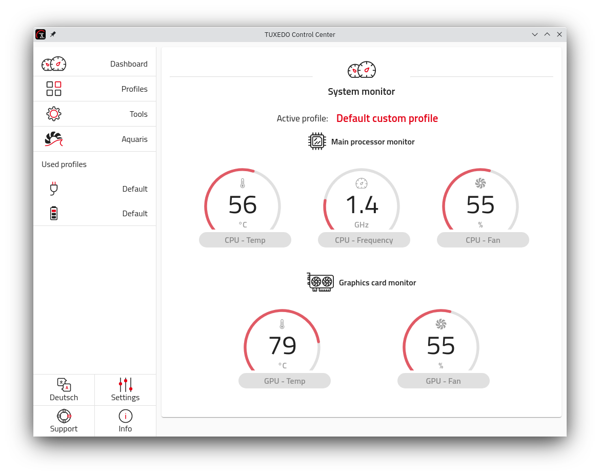


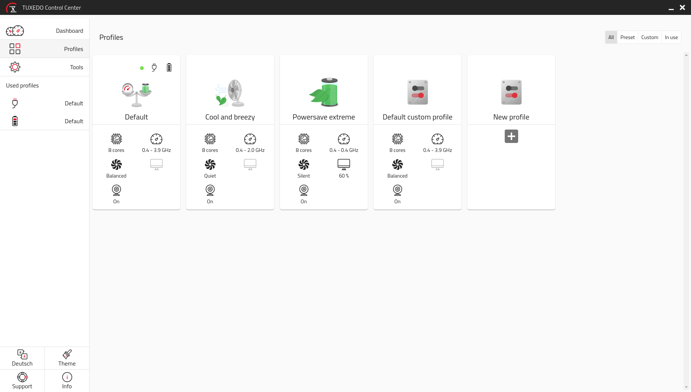

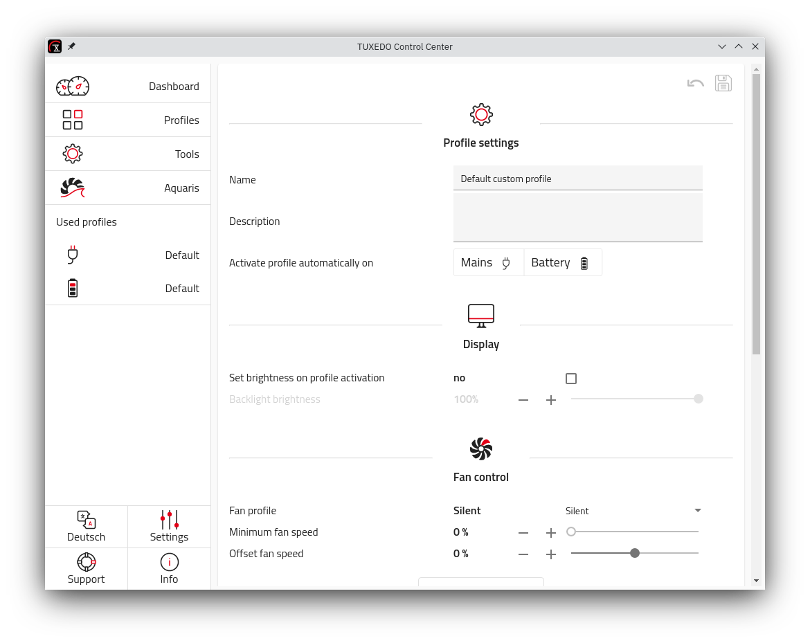

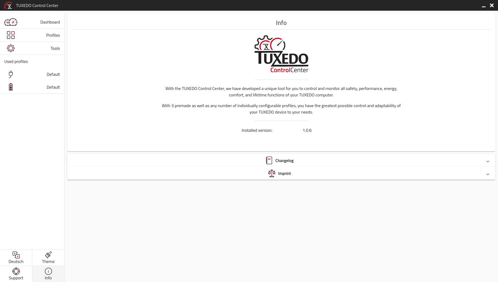

### German
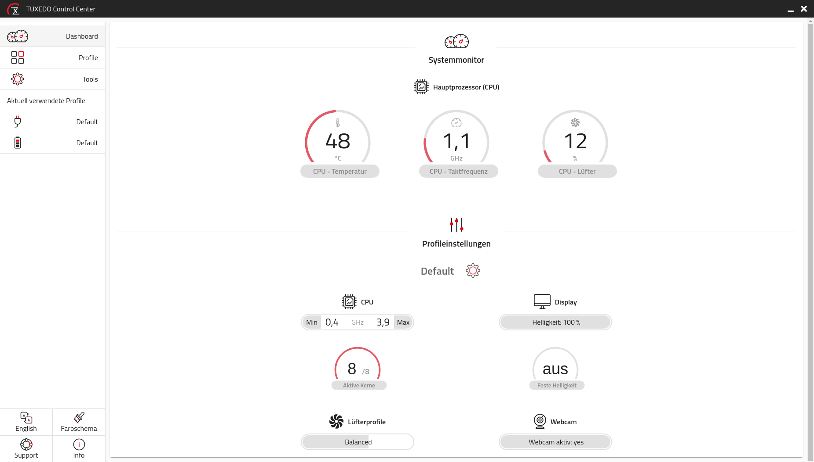

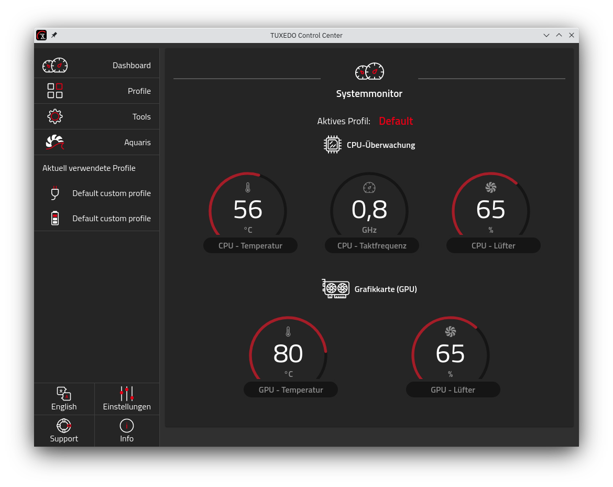

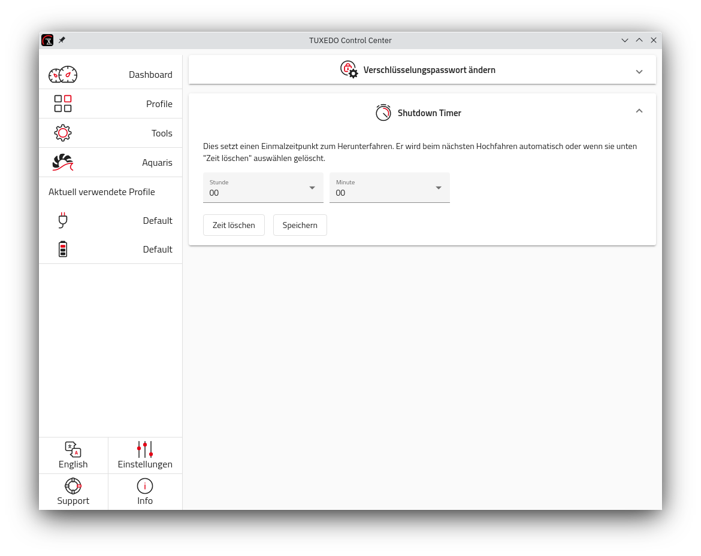

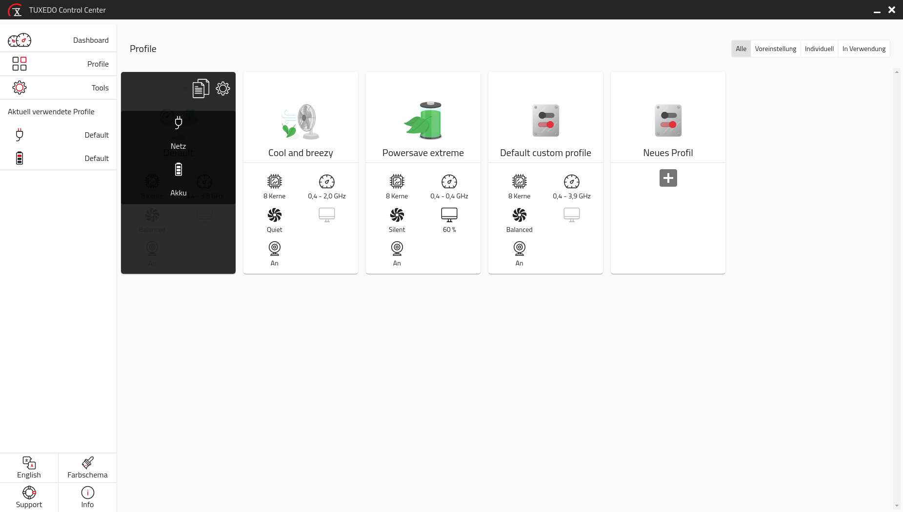


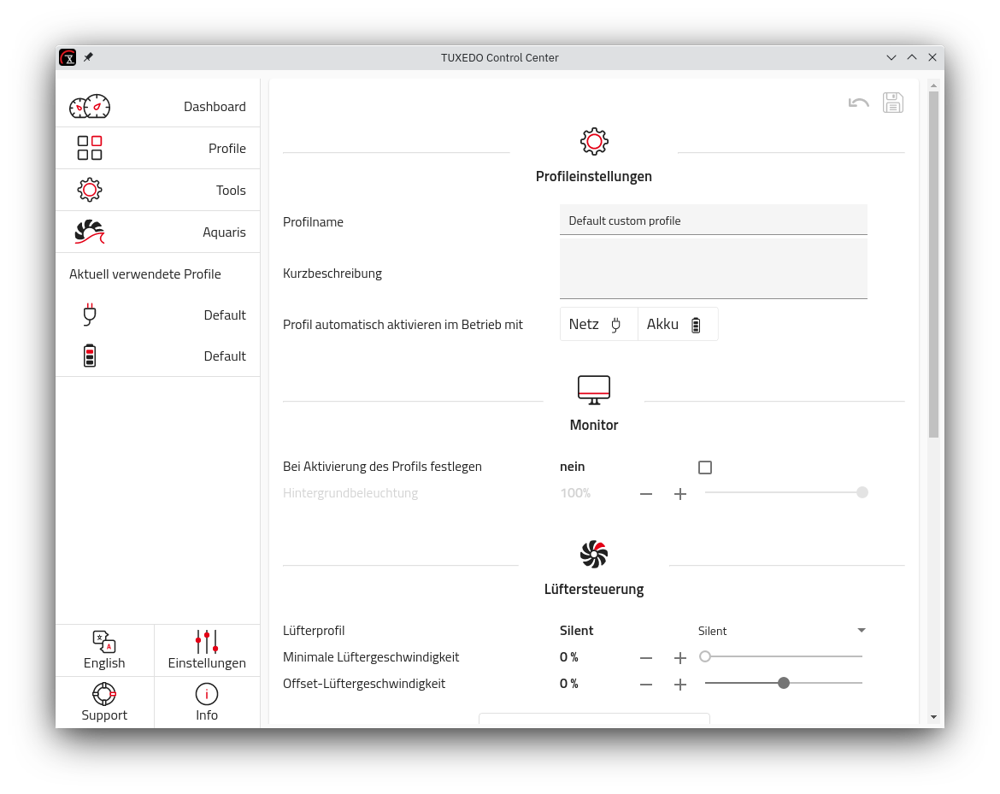

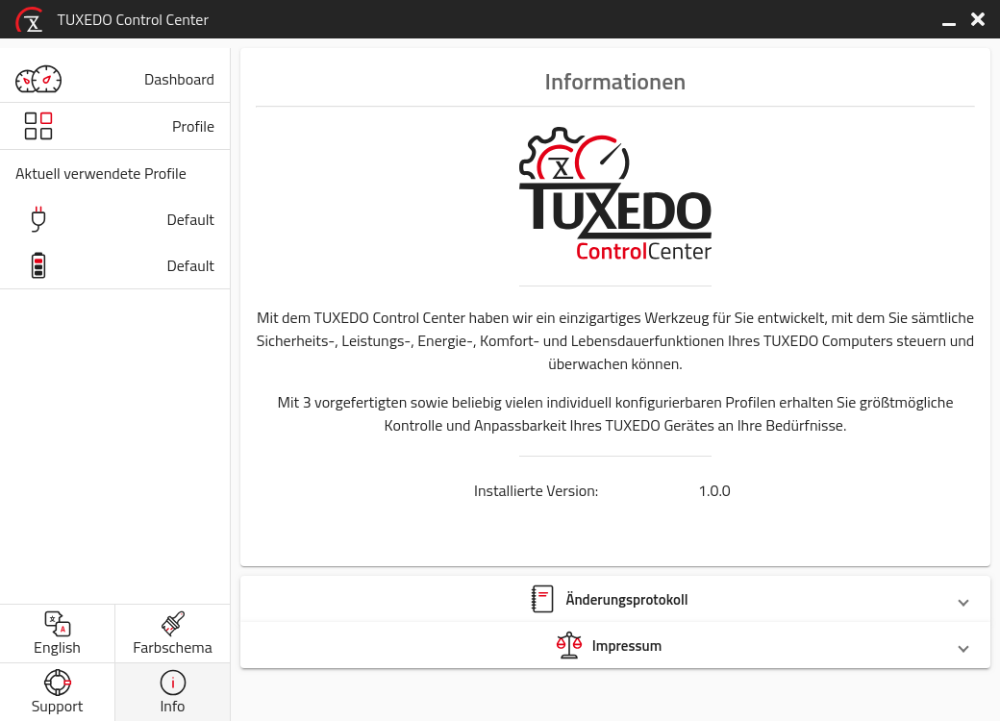
